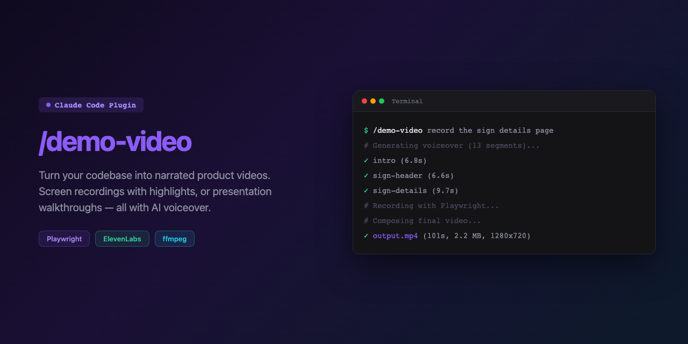

# /demo-video

**Turn your codebase into narrated product videos.**

A Claude Code plugin that creates AI-narrated demo videos from your web app or slide deck — screen recordings with highlighted sections, or presentation walkthroughs with synced slide transitions. All with natural AI voiceover.

[](https://claude.com/claude-code)
[](LICENSE)

---

## Quick Start

### Install

```
/plugin marketplace add morgandoochich/claude-demo-video
/plugin install demo-video@morgandoochich-claude-demo-video
```

### Use

```
/demo-video record the dashboard page with feature highlights
```

```
/demo-video narrate the pitch deck at public/pitch.html
```

```
/demo-video create a 60-second product intro presentation with voiceover
```

---

## Two Modes

| | Screen Recording | Presentation |
|---|---|---|
| **Use case** | Demo a live web app | Narrate a slide deck |
| **Input** | Page URL + sections to highlight | HTML presentation file |
| **Recording** | Playwright navigates, scrolls, highlights sections | Playwright advances slides synced to audio |
| **Output** | MP4 with purple section outlines + voiceover | MP4 with slide transitions + voiceover |
| **Auth** | Pre-authenticated via storageState | None needed (opens via `file://`) |

Both modes share the same voiceover pipeline, timing system, and composition step.

---

## How It Works

```
┌─────────────┐     ┌─────────────┐     ┌─────────────┐     ┌─────────────┐
│  VOICEOVER   │────▶│    AUTH      │────▶│   RECORD     │────▶│  COMPOSE    │
│              │     │  (optional)  │     │              │     │             │
│ ElevenLabs   │     │ Playwright   │     │ Playwright   │     │ ffmpeg      │
│ per-segment  │     │ storageState │     │ screen/slides│     │ video+audio │
│ exact timing │     │              │     │ synced to    │     │ final MP4   │
│              │     │              │     │ timestamps   │     │             │
└─────────────┘     └─────────────┘     └─────────────┘     └─────────────┘
```

### Per-Segment Chained Generation

The key to accurate audio/video sync. Each narration segment is a separate ElevenLabs API call with voice continuity chaining. This gives:

- **Exact measured durations** per segment (via ffprobe)
- **Exact start/end timestamps** (calculated, not guessed)
- **Controlled silence gaps** (1 second between segments)
- **Consistent voice** across all clips

### Timer-Based Sync

The recording spec uses absolute timestamps (`Date.now()` + `waitUntilVideoTime()`) instead of hold times. This absorbs all scroll/highlight/navigation overhead automatically — zero cumulative drift.

---

## What It Generates

When you invoke `/demo-video`, the skill creates a complete pipeline in your project:

```
project/
├── playwright.config.ts              # Video resolution, timeout
├── playwright/
│   ├── scenes-{name}.mjs             # Narration script
│   ├── create-auth-state.mjs         # Pre-auth (screen mode)
│   ├── record-{name}.spec.ts         # Recording spec
│   ├── generate-voiceover.mjs        # ElevenLabs TTS engine
│   ├── compose-video.mjs             # ffmpeg composition
│   └── voiceover-cache/              # Cached clips + timestamps
└── public/
    └── demo-outro.html               # Branded intro/outro screen
```

---

## Features

**Voiceover**
- Natural AI voices via ElevenLabs (search by accent, gender, language)
- Per-segment generation with voice continuity chaining
- Clips cached — regeneration only on text changes
- Phonetic brand name handling

**Screen Recording**
- Purple highlight outlines on each section being discussed
- Cards centred in viewport with overflow detection
- Cursor movement to highlighted sections
- Pre-authentication via storageState (no login in video)

**Presentation**
- HTML slide deck creation from templates
- Instant slide transitions (no animation artefacts)
- Nav bar/counter/progress bar updates
- Supports dark and light themes

**Composition**
- Automatic trim of pre-recording frames
- VP8→H.264 re-encoding for MP4
- `-shortest` flag trims to audio length
- Frame extraction for sync verification

---

## Prerequisites

```bash
# System
brew install ffmpeg

# Node (run in your project)
npm install -D @playwright/test @elevenlabs/elevenlabs-js
npx playwright install chromium

# Environment
export ELEVENLABS_API_KEY=your-key-here
```

Free tier (10,000 chars/month) covers most demo videos (~1,500 chars per video).

---

## Built From Experience

This skill was built from **33 documented lessons across 11 iterations** of real product demo videos. Every rule exists because something went wrong without it:

- Silence detection for splitting single-call audio → unreliable (solved: per-segment clips)
- Hold-time buffers accumulating 16.5s of drift → timer-based absolute timestamps
- `scrollIntoViewIfNeeded` clipping cards → `scrollIntoView({ block: 'center' })`
- Login frames appearing in video → storageState pre-auth
- `[pause]` markers read aloud by ElevenLabs → paragraph breaks only
- 800x450 video resolution → explicit `video.size` config

---

## License

MIT
